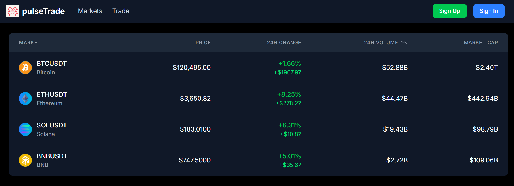
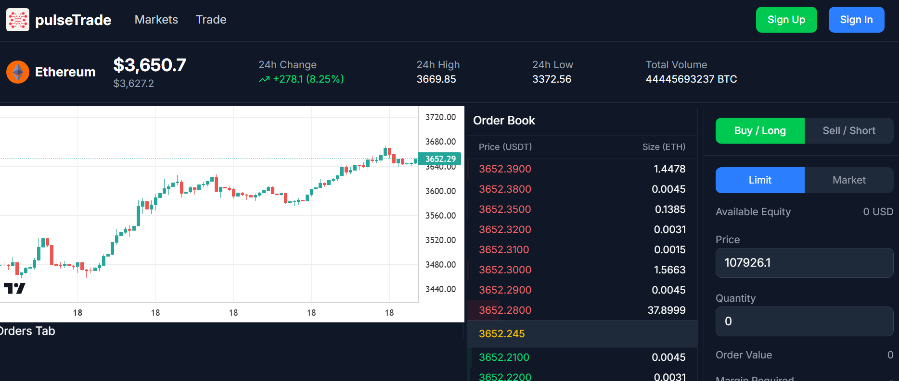

# pulseTrade

**pulseTrade** is a real-time cryptocurrency exchange simulation platform. Built with React and Tailwind CSS on the frontend, and a powerful backend stack using Node.js, Express, WebSockets, and Redis, it fetches and streams real orderbook and price data from Binance, simulates order handling via internal queues, and lays the foundation for a fully working exchange.

---
## 📸 Screenshots

### Markets Page


### Trade Page



---

## 📈 Live Features

- 🔹 **Markets Supported**: BTC/USDT, ETH/USDT, SOL/USDT, BNB/USDT
- 📊 **Charting**: Real-time candlestick chart (5-minute) directly via Binance WebSocket
- 📘 **Order Book**: Live depth data streamed through a custom WebSocket server
- 🔄 **Proxy Server**: Shields frontend from CORS/rate limits for Binance & Coinbase REST/WebSocket
- 🧠 **Order System Architecture**:
  - API server receives order requests from frontend
  - Redis Queue stores requests
  - Orderbook server consumes and (eventually) processes orders to maintain an in-memory book

---

## 🧱 Stack

**Frontend**  
- React (Vite)  
- Tailwind CSS  
- Lightweight Charts (TradingView)  

**Backend**  
- Node.js + Express  
- WebSockets  
- Redis Queue  
- Binance / Coinbase APIs  
- Custom Proxy Server  

---

## 🧪 Architecture Overview

```plaintext
[Frontend UI]
     ⬇️ REST & WS
[Proxy Server (5000)] <==> [Binance & Coinbase APIs]

[WebSocket Server (8080)]
     ⬆️ Binance Depth Stream
     ⬇️ Frontend Order Book

[API Server]
     ⬇️ Redis Queue

[Orderbook Server]
     ⬅️ Reads from Redis Queue
     ⏳ Processes (logic in development)
